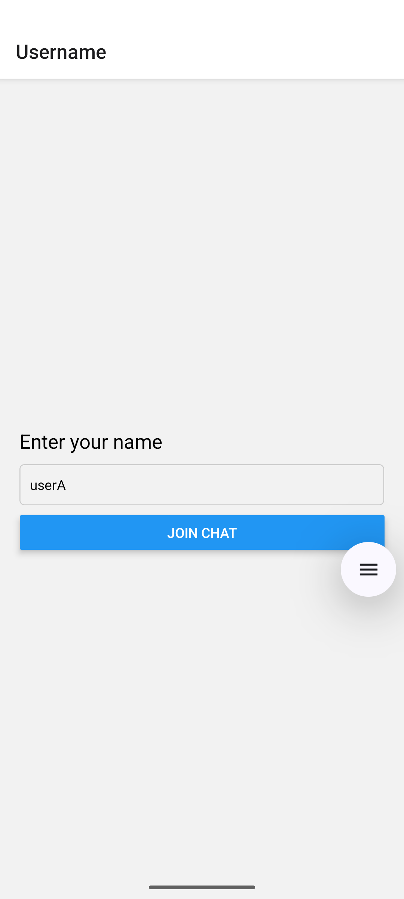
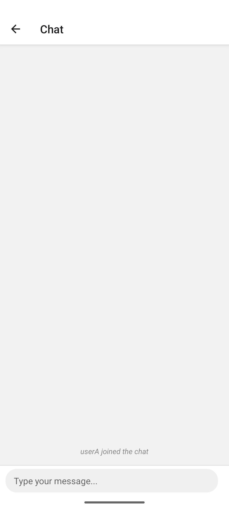
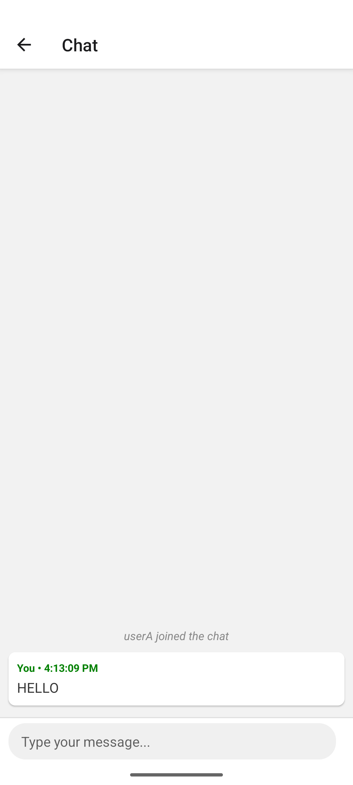
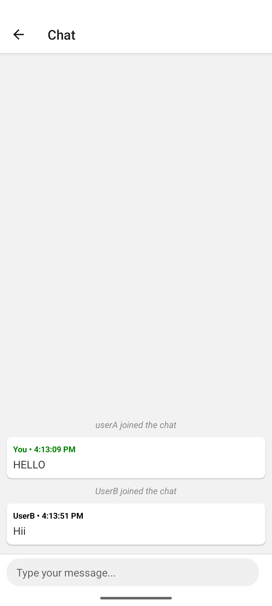

# 📱 Group Chat App

A real-time group chat application built with **React Native CLI** and **Node.js + Socket.IO**. Features live messaging, message history, system notifications, and a clean mobile-first interface.

## ✅ Features

* **Real-time messaging** via WebSocket (Socket.IO)
* **Message history** stored in memory (last 20 messages)
* **Inverted FlatList** for better chat UX (newest messages at bottom)
* **System notifications** for user join/leave events
* **Auto-scroll** to latest messages
* **Username validation** and navigation flow
* **Cross-platform** support (Android & iOS)
* **TypeScript** frontend with proper type safety
* **Modern ES6+** backend with graceful shutdown handling

## 📸 Screenshots

| Show 1 | Show 2 | Show 3 |
|--------|--------|--------|
|  |  |  |

| Show 4 | Show 5 | Show 6 |
|--------|--------|--------|
|  |  |  |

| Show 7 |
|--------|
| 

## 📦 Tech Stack

| Layer | Technology |
|-------|------------|
| **Frontend** | React Native CLI, TypeScript |
| **Backend** | Node.js, Socket.IO, ES6 Modules |
| **Navigation** | React Navigation v6 |
| **Protocol** | WebSocket |
| **Styling** | React Native StyleSheet |
| **Environment** | react-native-dotenv, dotenv |

## 🗂️ Project Structure

```
CHAT-APP/
├── client/                     # React Native frontend
│   ├── src/
│   │   ├── screens/
│   │   │   ├── ChatScreen.tsx       # Main chat interface
│   │   │   └── UserNameScreen.tsx   # Username entry screen
│   │   └── utils/
│   │       └── socket.ts            # Socket.IO client configuration
│   ├── .env                    # Client environment variables
│   ├── .eslintrc.js           # ESLint configuration
│   ├── .gitignore             # Git ignore rules
│   ├── .prettierrc.js         # Prettier configuration
│   ├── .watchmanconfig        # Watchman configuration
│   ├── App.tsx                # Root component with navigation
│   ├── app.json               # React Native app configuration
│   ├── babel.config.js        # Babel configuration for @env
│   ├── Gemfile                # Ruby dependencies
│   ├── index.js               # App entry point
│   ├── jest.config.js         # Jest testing configuration
│   ├── metro.config.js        # Metro bundler configuration
│   ├── package.json           # Frontend dependencies
│   ├── README.md              # Client-specific documentation
│   └── tsconfig.json          # TypeScript configuration
│
├── server/                     # Node.js backend
│   ├── src/
│   │   └── config/
│   │       ├── shutdown.js          # Graceful shutdown handling
│   │       └── socket.js            # Socket.IO server configuration
│   ├── .env                    # Server environment variables
│   ├── .gitignore             # Git ignore rules
│   ├── app.js                 # Express app setup
│   ├── index.js               # Server entry point
│   ├── package.json           # Backend dependencies
│   └── README.md              # Server-specific documentation
│
└── README.md                   # Main project documentation
```

## 🔧 Setup Instructions

### Prerequisites
- **Node.js** (v16 or higher)
- **React Native CLI** installed globally
- **Android Studio** (for Android development)
- **Xcode** (for iOS development - macOS only)
- **Java JDK** (for Android builds)

### 1. Clone the Repository

```bash
git clone https://github.com/yourusername/chat-app.git
cd chat-app
```

### 2. Setup Backend (Server)

```bash
cd server
npm install
```

Create `.env` file in `server/` directory:
```env
PORT=300X

```

Start the server:
```bash
npm start
```

Server will run on `http://localhost:300X`

### 3. Setup Frontend (Client)

```bash
cd ../client
npm install
```

Install React Native dependencies:
```bash
# For iOS (macOS only)
cd ios && pod install && cd ..

# For Android, ensure Android SDK is properly configured
```

Create `.env` and  `.env.d.ts` files in `client/` directory:
```env
HOST=192.000.0.000
PORT=300X
```

**Important:** Replace `192.000.0.000` with your actual IP address for device testing.


### 5. Run the Application

```bash
# Android
npx react-native run-android

# iOS (macOS only)
npx react-native run-ios
```

## 🔌 Socket Events

### Client → Server
| Event | Payload | Description |
|-------|---------|-------------|
| `send_message` | `{ username, text, timestamp }` | Send a chat message |
| `connection` | - | Establish socket connection |
| `disconnect` | - | Close socket connection |

### Server → Client
| Event | Payload | Description |
|-------|---------|-------------|
| `message_history` | `Message[]` | Initial message history (last 20) |
| `receive_message` | `Message` | New message broadcast |


## 🎯 Key Features Explained

### Navigation Flow
1. **Username Screen**: User enters their name
2. **Chat Screen**: Real-time messaging interface

### Message System
- **System Messages**: Join/leave notifications with italic styling
- **User Messages**: Color-coded (green for self, black for others)
- **Timestamps**: Formatted as `HH:MM:SS`
- **Auto-scroll**: Automatically scrolls to newest messages


**Server** (`src/config/socket.js`):
- Maintains message history in memory (last 20 messages)
- Handles graceful shutdowns
- Validates message content

## 📱 UI Components

### ChatScreen Features
- **FlatList with `inverted` prop** for natural chat flow
- **KeyboardAvoidingView** for iOS keyboard handling
- **Loading indicator** with 2-second delay simulation
- **Send button** appears only when input has content
- **System message styling** differentiated from user messages

### Styling Highlights
- **Card-based message design** with subtle shadows
- **Responsive input container** with rounded corners
- **Color-coded usernames** for message identification
- **Clean, modern UI** with proper spacing and typography

## 🛠️ Development Notes

### Dependencies
**Frontend:**
- `@react-navigation/native` & `@react-navigation/native-stack`
- `react-native-dotenv` for environment variables
- `socket.io-client` for WebSocket communication

**Backend:**
- `socket.io` for real-time communication
- `dotenv` for environment configuration
- `http` module for server creation

### Environment Configuration
- **Development**: Use IP address in `.env` for device testing
- **Production**: Configure proper domain/IP for deployment
- **Network Access**: Ensure firewall allows connections on specified port

## 🚀 Deployment Considerations

### For Production:
1. **Replace in-memory storage** with persistent database (MongoDB, PostgreSQL)
2. **Add authentication** system (JWT, OAuth)
3. **Implement message pagination** for large chat histories
4. **Add file/image sharing** capabilities
5. **Use Redis** for horizontal scaling with multiple server instances
6. **Add push notifications** for mobile devices
7. **Implement proper error handling** and reconnection strategies

### Scaling Options:
- **Database**: MongoDB, PostgreSQL, or Firebase Firestore
- **Caching**: Redis for session management
- **Hosting**: Heroku, AWS, or DigitalOcean
- **CDN**: CloudFront for static assets

##  Troubleshooting

### Common Issues:
1. **Connection refused**: Check if server is running and IP is correct
2. **Metro bundler errors**: Clear cache with `npx react-native start --reset-cache`
3. **Android build issues**: Ensure JAVA_HOME and Android SDK paths are set
4. **iOS build issues**: Run `cd ios && pod install` and check Xcode configuration

### Network Issues:
- Use `ipconfig` (Windows) or `ifconfig` (macOS/Linux) to find your IP
- Ensure devices are on the same network for local testing
- Check firewall settings for port access


## 👨‍💻 Contact

Built with ❤️ by [Tushar Maithani]

**Repository**: [[GitHub Link](https://github.com/Maithani-ji/GamersBergAssesment)]  
**Email**: maithaniji.official@gmail.com

---

*This app demonstrates real-time communication concepts and modern React Native development practices.*
